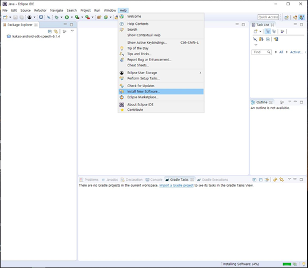
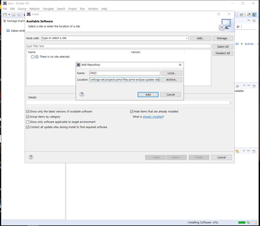
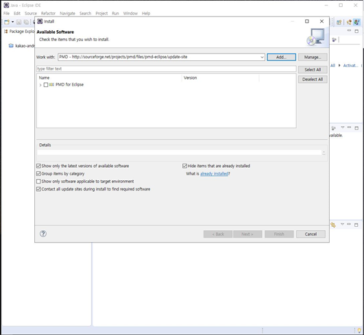
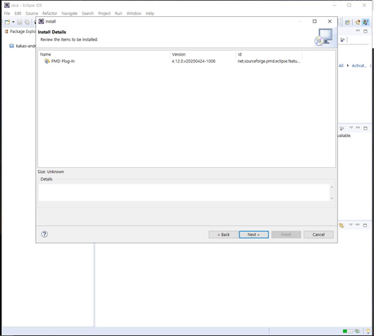
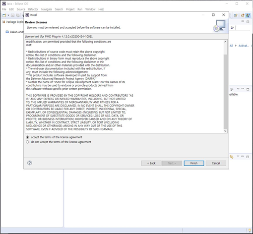
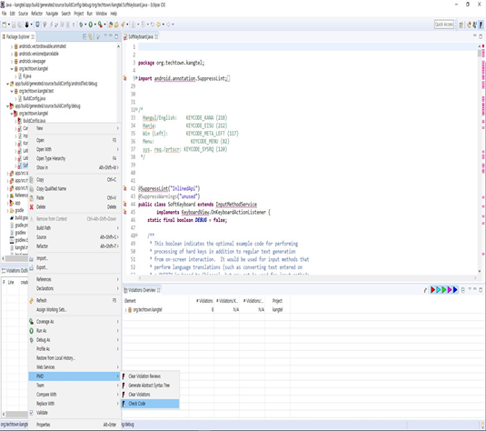
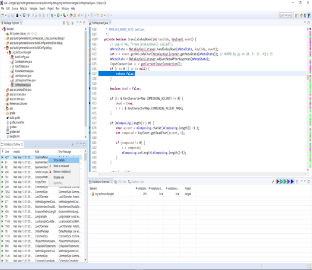
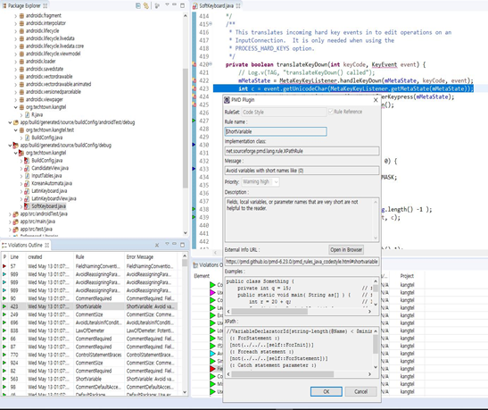
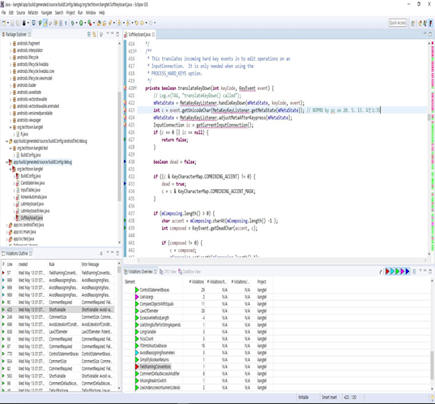
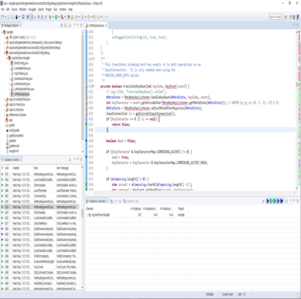

# 1. 언어 특성 활용하기

## 1-1. 언어 특성 파악하기

### 1-1-1. 프로그래밍 언어의 발전 과정

| 1970년대 이전 | 1970년대 | 1980년대 | 1990년대 | 2000년대 이후 |
|-------------------|-------------------|-------------------|-------------------|-------------------|
| FORTRAN<br>(1954) | PASCAL<br>(1970) | ADA<br>(1983) | Python<br>(1991) | C#<br>(2001) |
| COBOL<br>(1959) | C<br>(1972) | C++<br>(1983) | HTML<br>(1991) | Scala<br>(2003) |
| BASIC<br>(1964) | SMALLTALK<br>(1972) | Object-C<br>(1986) | JAVA<br>(1995) | Go<br>(2009) |
| BCPL<br>(1967) | SQL<br>(1978) | Perl<br>(1987) | PHP<br>(1995) | Swift<br>(2014) |

<br><br>

### 1-1-2. 프로그래밍 언어의 유형 분류

#### (1) 개발 편의성 측면의 분류

(가) 저급언어(Low-Level Language): 컴퓨터가 직접 이해할 수 있는 언어로 실행속도는 빠르나 기계마다 기계어가 상이하여 호환성이 없고 유지관리가 어렵다.

(나) 고급언어(High-Level Language): 개발자가 이해할 수 있도록 소스코드를 작성할 수 있는 언어로, 실행을 위해서는 번역 과정이 필요하다.

<br>

#### (2) 실행 및 구현 방식에 따른 분류

(가) 명령형 언어(Imperative Language): 컴퓨터가 동작해야 할 알고리즘을 통해 프로그래밍의 상태를 변경시키는 구문에 중점을 둔 방식으로 FORTRAN, C 등이 속한다.

(나) 함수형 언어(Functional Language): 함수의 응용을 강조하면서 자료의 처리는 수학적인 함수의 연산으로 취급하고, 상태와 가변 데이터는 멀리하는 방식으로 LISP, Scala 등이 속한다.

(다) 논리형 언어(Logic Language): 논리 문장을 이용하여 프로그램을 표현하고 조건이 만족되면 연관된 규칙이 실행되는 방식으로 PROLOG 등이 속한다.
(라) 객체지향언어(Object-Oriented Language): 객체 간의 메시지 통신을 이용하여 동작하는 방식으로 JAVA, C++ 등이 속한다.

(라) 객체지향형 언어(Object Oriented Language) : 객체 간의 관계에 초점을 두고 기능을 중심으로 메소드를 구현하는 방법으로 상속, 캡슐화, 다형성, 추상화 등의 특징을 가지고 있으며, JAVA, C++, SMALLTALK, PYTHON 등이 속한다.

<br>

#### (3) 빌드(Build) 방식에 따른 분류

- 프로그램의 소스코드가 실행 가능한 형태로 변하는 과정을 빌드(Build)라고 하며 빌드 방식에 따라 분류할 수 있다.

(가) 컴파일 언어(Compile Language): 소스코드가 기계어 실행 파일로 빌드되는 방식이다. C, C++ 등이 속하며 실행속도가 높은 특징이 있으며, 소스코드를 컴파일러를 통해 실행 가능한 형태의 기계어로 미리 번역하는 과정이 필요하며, 실행에 필요한 정보가 미리 계산되어 구동하는 시간은 오래 걸리지만 실행속도가 빠르다.

(나) 인터프리터 언어(Interpreter Language): 소스코드를 한 줄씩 번역하여 실행하는 방식이다. Python 등이 속하고 실시간 실행 및 분석이 가능한 특징이 있으며, 별도의 컴파일 과정 없이 바로 실행 가능한 장점이 있으나 소스코드를 하나씩 번역하여 실행함으로써 실행속도는 느린 특징이 있다.

(다) 바이트 코드 언어(Byte Code Language): 컴파일을 통해 가상머신이 번역할 수 있는 Byte Code로 변환되며, 가상머신은 다시 Native OS가 이해할 수 있는 기계어로 번역하는 방식이다. JAVA, Scala 등이 속하며, 컴파일을 통해 고급언어를 중간 언어로 변환한 후 가상머신에 의해 번역을 실행하는 방식으로 여러 환경에서 사용 가능한 특징이 있다.

<br>

#### (4) 컴파일러와 인터프리터

- 고급언어로 작성한 소스코드의 경우 컴퓨터가 이해할 수 없으므로 컴파일러나 인터프리터를 이용하여 컴퓨터가 이해하고 실행할 수 있는 기계어 코드로 번역을 수행한다.

1) 컴파일러와 인터프리터 동작 방식 

- 컴파일러의 경우 소스코드를 목적 코드로 변환하여 실행하는 방식이며, 인터프리터의 경우 문장 단위로 읽어들여 해석을 하여 실행한다.


<br>

2) 컴파일러와 인터프리터 비교

- 컴파일 방식의 경우 실행속도가 빠르고 보안적인 측면에서는 유리한 장점이 있으나 매번 빌드 작업을 거쳐야 하는 불편함이 존재하며, 인터프리터 방식의 경우 즉시 수정 및 실행이 가능한 장점은 있으나 처리속도가 느린 단점이 있다.

| 구분 | 컴파일러 | 인터프리터 |
|--------------|-------------------------------------|-----------------------------------------|
| 개발 편의성 | 코드를 수정하고 실행이 필요한 경우<br> 재컴파일 필요 |  코드 수정 후 즉시 실행 가능 |
| 번역 단위 | 전체 소스코드 | 문장 단위 |
| 실행 파일 및 속도  | 실행 파일 생성<br> 처리속도 빠름 | 실행 파일 미생성<br> 처리속도 느림 |
| 메모리 할당 | 실행 파일 생성 시 사용 | 할당하지 않음 |
| 오류 확인 및 처리 | 전체 코드에 대한 컴파일 수행 시 <br>발생한 오류 확인 가능 | 프로그램 실행 후 오류가 발생한 <br>문장 이후의 코드는 실행하지 않음 |
| 파일 용량 및 보안 | 실행 파일 전체를 처리해야 하므로<br> 용량이 크며, 원시 코드의 유출 가능성이<br> 상대적으로 낮음 | 원시 코드만 처리하면 되므로 용량이 <br>상대적으로 작고, 원시 코드의<br> 유출 가능성이 높음 |
| 주요 언어 | C, C++, JAVA |  Python, Javascript, Ruby |

<br><br>

#### (5) 프로그래밍 언어별 설명 및 특성

| 언어 | 특성 |
|--------------|-------------------------------------|
| FORTRAN | IBM에서 과학적인 계산을 하기 위해 시작된 언어로 간결하고 엄격한 구문 형식의 언어. 컴퓨터 시스템에 대해 많은 관련 지식이 필요하며 기상예측, 자원탐사, 우주 항공, 유체 및 구조해석 등의 과학계산 전문 분야에 활용 |
| COBOL | 미국 국방성에 의해 개발되었으며 비즈니스, 금융, 회사/정부 관리 시스템에 주로 사용. 메인프레임 컴퓨터의 레거시 응용프로그램들에 사용되고 있으며, 비교적 프로그램 크기가 크고 구문이 복잡 |
| PASCAL | 잘 짜인 구조와 간결성으로 프로그래밍 교육을 위해서 널리 사용되었으며, 파스칼에 객체지향 개념을 포함한 오브젝트 파스칼(Object Pascal), 오브젝트 파스칼을 일부 변형한 델파이(Delphi) 프로그래밍 언어로 발전 |
| C |  UNIX 운영체제 구현에 사용되는 언어이며 효율적인 실행과 간결한 문법, 효과적인 포인터 타입 제공이라는 특징으로 인해 많이 사용되고 있는 시스템 프로그래밍 언어 |
| C++/C# | C 언어에서 발전한 언어로 다중 상속 등의 기능을 제공하는 객체지향 프로그래밍 언어- C#: C와 C++의 발전된 형태로 .NET 환경에 맞춰 설계되었으며, 사용자 인터페이스를 쉽게 만들 수 있는 컴포넌트 기능도 제공 |
| PHP | 웹 개발에 특화된 언어로 다양한 프레임워크를 지원하고 특별한 컴포넌트 설치를 하지 않아도 다양한 처리가 가능 |
| JAVA | C++에 비해 단순하고 분산환경과 객체지향, 보안성을 지원하고 컴파일을 통해 class 파일을 생성하며 가상머신(JVM)에서 실행 |
| JAVASCRIPT | HTML, CSS와 함께 웹을 구성하는 핵심 요소로 거의 모든 웹 브라우저에 스크립트 엔진(인터프리터)이 존재. 웹 페이지의 동작 구현이 가능하고 빠른 개발과 확장성이 뛰어나지만 다른 언어에 비해 상대적으로 보안이나 성능이 부족 |
| PYTHON | 배우기 쉽고 이식성이 좋은 언어로 다양한 함수들도 많이 제공되어 최근 트렌드와 맞물려 스타트업과 글로벌 기업 등에서도 많이 사용하는 언어 |
| GOLANG | Google에서 만든 언어로 짧게는 GO라고도 부르며 내장 라이브러리가 많이 지원되고 C언어의 문법과 유사하나 제어 구조를 가지고 빠른 컴파일이 가능함 |
| KOTLIN | JAVA보다 간결한 문법을 가지고 있는 JVM 기반의 언어로 JAVA와의 상호 운용이 100% 지원되고 2019년 구글이 안드로이드의 공식 언어로 추가 |
| R | 통계 및 그래프 작업을 위한 인터프리터 프로그래밍 언어로 수많은 통계 관련 패키지가 개발되어 있고 빅데이터 분석 및 기계학습 등에 유용 |

<br><br>

#### (6) 프로그램 언어별 Hello World

##### FORTRAN 코드

```fortran
Print *, "Hello, World!!"
```

##### COBOL 코드

```cobol
IDENTIFICATION DIVISION.
    PROGRAM-ID. HELLO-WORLD.
    PROCEDURE DIVISION
    DISPLAY 'Hello, World!!'.
    STOP RUN.
```

<br>

##### BASIC 코드

```basic
PRINT "hello, world!!";
```

<br>

##### PASCAL

```pascal
program Hello(output);
begin
    writeln('hello world')
end.
```

<br>

##### C 코드

```c
#include <stdio.h>
int main(void){
    puts("Hello, World!!");
    return 0;
}
```

<br>

##### JAVA 코드

```java
 public static void main(String[] args) {
    System.out.println("Hello, World!!");
 }
```

<br>

##### KOTLIN 코드

```kotlin
fun main(args:Array<String>){
 println("Hello, World!!")
 }
```

<br>

##### ASP 코드

```asp
<%
    Response.Write( "Hello, World!!"); 
%>
```

<br>

##### PHP 코드

```php
 <?php
    echo ("Hello, World!!");
 ?>
```

<br>

##### JSP 코드

```jsp
 <%
    out.println ("Hello, World!!");
 %>
```

<br>

##### PYTHON 코드

```python
print("Hello, World!!")
```

<br>

##### RUBY 코드

```ruby
puts "Hello, World!"
```

<br>

##### GoLang 코드

```golang
import "fmt"
func main() {
	fmt.Println("hello world")
}
```

<br>

##### R 코드

```r
print("Hello, World!!")
```
<br>

##### BASH 코드

```bash
echo "hello world"
```

<br>

##### Swift 코드

```swift
println("Hello, world!!")
```

<br>

##### Scala 코드

```
object HelloWorld {
  def main(args: Array[String]): Unit = {
    println("Hello, world!")
  }
}
```

<br>

##### JAVASCRIPT 코드

```javascript
alert("Hello, World!!");
document.write("Hello, World!!");
```
<br><br>

### 1-1-3. 객체 지향 언어의 구성요소와 특징

#### (1) 객체 지향 언어의 구성요소

1) 객체(Object): 개체와 속성, 메소드로 구성된 클래스의 Instance를 의미한다.
2) 클래스(Class): 공통된 특성(속성, 연산)을 가지는 객체 집합으로 객체 타입을 정의하고 생성하는 틀이다.
3) 메시지(Message): 객체 간의 상호작용은 메시지를 통해 이루어지며 메시지는 객체에서 객체로 전달된다.
4) 생성자(Constructor) : 클래스로 부터 객체를 생성할 수 있도록 정의하는 함수이다.
5) 멤버 필드(Member Field) : 객체에 속한 속성으로 해당 객체에 대한 특정 정보를 저장하고 있는 멤버이다.
6) 멤버 메소드(Member Method) : 특정 객체가 갖는 활동(연산)을 하나의 이름으로 정의하고, 호출하여 실행하는 멤버이다.

<br>

#### (2) 객체 지향 언어의 특징

- 캡슐화(Encapsulation): 연관된 데이터와 데이터를 처리하는 함수를 함께 묶어 외부에는 필요한 인터페이스만을 노출한다.
- 정보 은닉(Information Hiding): 다른 객체에게 자신의 필드 및 메소드 등을 은닉하고 자신의 연산만을 통하여 접근을 허용한다.
- 추상화(Abstraction): 불필요한 부분은 생략하고 주어진 문제나 시스템 중에서 중요한 부분에 집중하여 모델링한다.
- 상속(Inheritance): 하위 클래스에서 상위 클래스의 속성과 메소드를 물려받는 기법으로 클래스와 객체의 재사용이 가능하다.
- 다형성(Polymorphism): 하나의 메시지에 대해 각 객체의 고유한 방법으로 응답한다.

<br>

#### (3) 객체 지향 언어와 절차 지향 언어의 차이

| 구분 | 절차지향 | 객체지향 |
|-------------|-------------------------------------------------------|-------------------------------------------------------|
| 구성 | 함수 | 객체 |
| 구현 방식 | 전체적인 기능 동작을 고려한 각 단계별 기능 구현 | 필요한 속성의 객체 모델링 후 상호작용 
기능 구현 |
| 접근제어 | 없음 | 가능(public, private) |
| 상속/다형성 | 없음 | 가능 |
| 보안성 | 낮음 | 높음 |
| 장점 | 프로그램 흐름을 쉽게 추적 가능<br> 복잡도가 단순하고 실행속도가 상대<br>적으로 빠름 | 뛰어난 재사용 및 확장성, 유지보수의 용이성 보유<br>규모가 크고 협업이 필요한 대형 프로젝트 적합 |
| 단점 | 큰 프로젝트의 경우 구조 복잡, 중복 코드 발생,<br> 유기성이 높아 신규 기능 추가 등이 어려움 | 상대적으로 속도가 느리고 메모리 사용율이 높음<br> 설계 과정에 많은 시간 소요 |
| 대표적 언어 | C, Fortran, Pascal |  JAVA, C++, Python |

<br><hr><br>

## 1-2. 애플리케이션 구현 및 최적화

### 1-2-1. 코드 인스펙션(Code Inspection)과 리팩토링(Refactoring)

- 프로그램 소스코드를 실행하지 않고 코드상에서의 잠재적인 오류와 표준 미준수 등의 결함을 사전에 식별하여 개선하는 공식적인 리뷰(Review) 기법

<br>

#### (1) 인스펙션 수행 절차

| 단계 | 수행 내용 |
|------------------|--------------------------------------------------------------------------------|
| 1. 계획(Planning) | 인스펙션 대상 산출물 선정 및 대상자를 구성. 인스펙션 대상 산출물을 사전에 배포하고 날짜와 시간 및 장소를 공지한다. |
| 2. 개관(Overview) | 참여자를 대상으로 산출물에 대한 이해도를 높여 인스펙션의 효과성을 향상 시킬 수 있으며 생략 가능하다. |
| 3. 준비(Preparation) | 구성원이 개별적으로 산출물에 대해 숙지하고 체크리스트를 활용하여 결함 부분에 대해서 기록한다. |
| 4. 검토회의(Meeting) | 산출물을 함께 검토하며 준비단계나 검토회의에서 식별된 결함 부분에 대해 집중한다. |
| 5. 재작업(Rework) | 검토회의에서 발견된 결함에 대해 수정한다. |
| 6. 추적(Follow-up) | 결함이 정상적으로 수정되었는지 최종 확인하고 인스펙션을 종료한다. |

<br>

#### (2) 인스펙션 참여자와 수행 목적

- 중재자(Moderator), 저자(Author), 진행자(Reader), 검토자(Inspector), 기록자(Recorder) 등으로 구성된다.
- 대부분 조기에 결함을 식별하여 수정하므로써 인스펙션 비용을 절감하고, 코드 품질을 향상시키며, 유사 결함에 대비하여 결함 발생을 예방하고, 유지 보수 효율을 향상하는데 그 목적이 있다. 

<br>

#### (3) 코드 리뷰 기법

- 프로젝트 상황 및 코드의 중요도에 따라 동료검토, 전문가 검토, 워크스루, 테크니컬 리뷰, 인스펙션 등의 기법 등이 있다.

| 단계 | 수행 내용 |
|------------------|--------------------------------------------------------------------------------|
| 동료검토(Peer Review) | 별도의 절차 없이 비공식으로 계획 없이 임의적으로 실시되며, 개발자가 동료와 코드 및 산출물의 결함을 식별하는 기법 |
| 팀 검토(Team Review) | 팀 단위 내에서 공유문서나 산출물을 바탕으로 코드의 결함을 찾아가는 리뷰 기법 |
| 워크스루(Walk Through) | 개발자가 리뷰의 주제와 시간을 정해서 발표를 하고 동료들로부터 의견이나 아이디어를 듣는 시간을 가질 수 있으며, 사례에 대한 정보 공유나 아이디어 수집을 위해서 사용될 수 있다. |
| 코드 인스펙션(Code Inspection) | 역할과 절차, 체크리스트를 기준으로 결함을 식별하는 공식적인 리뷰 기법 |
| 테크니컬 리뷰(Technical Review) | 워크스루(Workthrough), 검사(Inspection), 코드확인(Code Reading) 등을 포함하는 리뷰기법으로 프로젝트 산출물에 대한 결함을 발견하여 수정하는 코드 리뷰 기법 |
| 전문가 리뷰(Expert Review) | 코드 인스펙션 기법으로 개발 전문성을 가진 그룹이 진행하게 하는 코드 리뷰 기법 |
| 패스 어라운드(Pass Around) | 결점을 최대한 찾기 위하여 프로젝트 코드를 여러 구성원이 돌아가면서 진행하는 오프라인 방식의 리뷰 기법 |


<br>

#### (4) 리팩토링(Refactoring)

- SW의 원래 기능은 유지하면서 소스코드의 내부 구조를 수정 및 보완하여 가독성, 성능 
향상 및 로직을 개선하는 기법

<br>

##### 주요 리팩토링 대상 및 결점 제거 방법

| 리팩토링 대상 | 리팩토링 방법 |
|--------------------------------------------|-----------------------------------------------------------|
| 중복된 코드(Duplicated Code) | 중복을 제거해야 한다. |
| 긴 메소드(Long Method) | 메소드를 적정 수준의 크기로 나누어야 한다. |
| 긴 파라미터 리스트(Long Parameter List) | 파라미터 개수를 줄여야 한다. |
| 게으른 클래스(Lazy Class) | 자식 클래스와 부모 클래스의 차이가 없으면 합친다. |
| 주석(Comment) | 주석이 없어도 코드를 이해할 수 있도록 소스코드를 변경한다. |
| 메시지 체인(Message Chain) | 특정 객체를 얻기 위한 다수 객체는 간소화한다. |
| 미들 맨(Middle Man) | 다른 클래스로 위임하는 역할만 담당하는 클래스 제거를 검토한다. |
| 불완전 라이브러리(Incomplete Library) | 불완전 시 필요 부분 추가 구성한다. |
| 스위치 명령문(Switch Statements) | 지나치게 많은 case를 사용하는 Switch 문장은 코드 중복의 신호이다. |

<br>

##### 리팩토링 수행 절차

- 정상 동작하는 코드를 대상으로 Bad Smell이 있는 부분을 지속적으로 개선하여 재구성하며, Bad Smell은 코드 인스펙션과 PMD 등의 Tool을 이용하여 식별할 수 있다.


<br>

##### 웹 애플리케이션의 취약점 TOP 10(OWASP Top 10)

- OWASP(The Open Web Application Security Project)는 웹 애플리케이션에 대한 보안 프로젝트로서 웹 애플리케이션 취약점 중에서 빈도가 많이 발생하고 보안상 영향을 크게 줄 수 있는 10가지를 말한다.

| 항목 | 상세 내용 |
|------------------------------------|-----------------------------------------------------------|
| Injection(인젝션) | 웹 애플리케이션에 비정상적인 명령어나 Query 등을 보내 공격자가 시스템에 불법적으로 접근할 수 있는 취약점 |
| Broken Authentication(취약한 인증) | 잘못 구현된 인증이나 Session 관리 기능으로 인해 일시적 혹은 영구적으로 공격자가 다른 사용자의 권한을 획득할 수 있는 취약점 |
| Sensitive Data Exposure(민감한 데이터 노출) | 개인 식별 정보나 신용 정보 등의 민감 데이터 저장 및 전송 시 노출 취약점 |
| XML External Entities(XXE) (XML 외부 개체) | XML 문서에서 External Entity를 이용하여 공격자가 의도하는 외부 URL을 실행하여 서버의 로컬파일 정보를 출력하거나 서비스 거부 공격을 수행할 수 있는 취약점 |
| Broken Access control (취약한 접근 통제) | 다른 사용자의 계정 접근, 중요 데이터 열람 및 수정, 액세스 권한 변경 등의 악의적인 행위가 가능한 취약점 |
| Security misconfigurations (잘못된 보안 구성) | 안전하지 않은 구성, 잘못된 구성으로 HTTP Header나 민감 정보가 포함된 에러 메시지 등으로 인한 취약점 |
| Cross Site Scripting (XSS) (크로스 사이트 스크립팅) | 웹 페이지에 악성 스크립트를 삽입할 수 있는 취약점으로 사용자의 정보(쿠키, 세션 등)를 탈취하거나 악의적인 사이트로 이동할 수 있는 취약점 |
| Insecure Deserialization (안전하지 않은 역직렬화) | 데이터를 역직렬화하는 과정에서 원격코드 실행이나 권한 상승 등이 가능한 취약점 |
| Using Components with Known Vulnerabilities(알려진 취약점이 있는 구성요소 사용) | 취약한 컴포넌트가 악용되는 경우 서버가 장악되거나 심각한 데이터 손실을 발생할 수 있는 취약점 |
| Insufficient logging and monitoring (불충분한 로깅 및 모니터링) | 충분하지 않은 로깅과 모니터링을 통해 시스템을 추가로 공격하고 데이터를 변조하거나 추출, 파괴 가능한 취약점 |

<br>

### 1-2-2. 코드 인스펙션(Code Inspection) 진행하기

#### (1) 코드 인스펙션(Code Inspection) 진행 방법

- 정적 분석(Static Analysis) : 동적 분석(Dynamic Analysis)과 상대되는 개념으로 소프트웨어를 실행하지 않고 코드 레벨에서 분석하는 방법으로 소스코드의 실행 없이 코드의 의미를 분석해 결함을 찾아내는 코드 분석 기법
-  PMD(Programming Mistake Detector) : 응용프로그램 코드의 문제를 사전에 확인할 수 있는 정적 분석을 위한 오픈 소스코드 분석 도구

<br>

#### (2) PMD(Programming Mistake Detector) 도구 설치 및 사용하기 

[PMD 공식 사이트](https://pmd.github.io/)

1. 이클립스를 실행한 후 -> Help -> Install New Software로 들어갑니다.



<br>

2. 이름과 주소를 입력하고 [Add] 버튼을 누릅니다.
- 이름(Name) : pmd1
- 주소 : http://sourceforge.net/projects/pmd/files/pmd-eclipse/update-site




<br>

3. 나온 목록에서 "PMD for Eclipse" 항목을 체크하고, [Next] 또는 [Ok] 버튼을 눌러 다운로드를 합닏.ㅏ




<br>

4. [Next] 버튼을 누르고, License agreement에 동의 후 설치를 진행합니다.





<br>

5. 설치 중 보안 경고가 나오면 Install anyway를 선택하고 계속 설치를 진행합니다.


<br>

6. 이클립스를 종료하고, 다시 시작하고, 아래와 같이 검사할 클래스 또는 패키지를 선택하고, 마우스 오른쪽 버튼을 눌러 나오는 메뉴에서 PMD -> Check Code를 클릭합니다.




<br>

7. 왼쪽 하단의 패널에서 체크 항목 중에서 보고 싶은 체크 내용중에서 마우스 오른쪽 버튼을 누르고 나오는 메뉴에서 Show details를 선택하여 상세한 위반사항을 확인합니다.





※ 위 화면은 변수의 이름이 너무 짧은 것에 대한 경고입니다.

<br>

8. 수정할 항목이 있는 곳에서 아래 화면과 같이 수정 후 확인을 위해 Mark as reviewed 선택하여 자동으로 주석처리를 합니다.




<br>

9. 다시 검사 -> 423번째 줄(변수 이름 위반) 경고 사항 수정 완료 확인합니다.



<br>

10. 결함의 위험 수준은 아래와 같으니 그 중에서 Blocker나 Critical 은 반드시 결함을 수정해야 합니다.

- 기본적으로 빨간색 (매우 높은 위반) -> 파랑 (낮은 위반) 으로 분류


#### (3) PMD 기본 룰셋과 결함 위험 수준

#### PMD 기본 룰셋

| 기본 Rule | 내용 설명 |
|-------------------------------|------------------------------------------------------------|
| EmptyFinallyBlock | 비어 있는 Finally 구문 단락 |
| EmptyCatchBlock | 비어 있는 Catch 구문 단락 |
| UnnecessaryReturn | 불필요한 Return 구문 |
| DuplicateImports |  Import문이 중복 선언 |
| AvoidReassigningParameters | 넘겨받는 메소드 Parameter 값을 직접 변경 |
| EqualsNull |  Null 값과 비교하기 위해 Equals 메소드를 사용 |
| UnnecessaryParentheses | 불필요한 괄호 사용 |
| VariableNamingConventions |  Final이 아닌 변수는 밑줄을 포함할 수 없음 |
| StringToString |  String 객체에서 toString() 함수를 사용 |
| UnusedPrivateField | 사용되지 않는 Private field |
| UnusedPrivateMethod | 사용되지 않는 Private Method |

※ 참고 사항  - [공개SW를활용한 소프트웨어개발보안점검가이드](https://www.mois.go.kr/cmm/fms/FileDown.do?atchFileId=FILE_00087426ekjOwJj&fileSn=1)

<br>

#### PMD 결함 위험 수준

| 우선 순위 | 설명 |
|---------------|------------------------------------------------------------------------------|
| Blocker (긴급) | 전체 프로젝트의 진행을 막고 있는 가장 우선적으로 처리해야 할 이슈의 우선순위 레벨 |
| Critical (심각) | 데이터 손실, 심각한 메모리 결함과 같은 치명적인 문제를 발생시키는 이슈의 우선순위 레벨 |
| Major (높음) | 기능 수행 자체에 영향을 주는 이슈 우선순위 레벨 |
| Minor (보통) | 기능의 최소한의 손실이나 간단한 문제점을 발생시키는 이슈의 우선순위 레벨 |
| Trivial (낮음) | 철자오류나 텍스트의 조정 불량과 같은 표면적이며 기능자체와 직접적인 연관은 없는 사소한 문제를 발생시키는 이슈의 우선순위 레벨 |

<br>

#### 이슈 타입

| 이슈 타입 | 설명 |
|--------------------|----------------------------------------------------------------------------------|	
| BUG (문제점) | 제품 혹은 소프트웨어의 기능을 방해하는 문제 |
| Improvement (개선사항) | 기존의 기능을 향상시키는 것. |
| New Feature (새 기능) | 아직 개발되지 않은 새로운 기능 |
| Task (업무) | 실행해야 하는 업무. |
| Story | User Story |

<br>

#### 이슈 상태

| 이슈 상태 | 설명 |
|--------------------|----------------------------------------------------------------------------------|
| Open (개설) | 이슈는 초기에 "Open"상태 |
| In Progress (진행중) | 현재 담당자에 의해 작업이 검토 혹은 수정이 이루어지고 있습니다. |
| Resolved (해결) | 해결이 되고 보고자로부터의 확인을 기다리고 있습니다. 여기에서 이슈는 보고자가 확인 후 재수정이 필요한 경우는 재오픈 되어지고 만약 바람직한 상태로 해결된 것이 확인되면 이슈는 종결되고 종결됨이 표시됩니다. |
| Reopened (재오픈) | 이슈가 일단 해결되었지만 그 해결이 부정확하다고 판단되었을 경우 사용합니다. 예를 들어 더 자세한 정보가 발견되어 추가 확인이 필요한 경우나 혹은 문제가 재현이 되는 경우 사용되며, 오픈된 이슈들은 다시 In Progress(진행중), Resolved(해결) 또는 Closed (종료)의 상태로 진행이 되게 됩니다. |
| Closed (종료) | 이슈가 충분히 숙고하여 해결되었고 그 해결이 정확할 경우 사용됩니다. 이슈는 완전히 종료되거나 혹은 다시 작업해야 할 경우 Reopened (재오픈) 되어 다시 처리되어져야 합니다. |

<br>

#### 이슈 처리 상태

| 이슈 처리 상태 | 설명 |
|--------------------|----------------------------------------------------------------------------------|
| Fixed (수정) | 해당 이슈가 처리됨. |
| Won't Fix (수정 불가) | 해결할 수 없는 이슈 |
| Duplicate (중복) | 이 문제는 기존이슈와 중복된 것입니다. 이 해결책을 처리하기 위해서 중복된 이슈에 link(링크)할 것을 권장합니다. |
| Incomplete (정보부족) | 이슈에서 작업할 정보가 충분치 않습니다 |
| Cannot reproduce (재현 불가능) | 이슈의 재현을 위한 모든 시도들이 효과가 없었거나 이슈를 재현하기 위한 정보가 충분치 않았습니다. 차후에 더 자세한 정보가 나타날 경우 이슈를 재오픈하시기 바랍니다. |

<br>

### [PMD 도구의 활용 상세](PMD%20활용.pdf)

<br><br>

## 1-3. 애플리케이션 개발환경 구축하기

### 1-3-1. 파이썬 개발환경 구축하기

<br><br>

### 1-3-2. 자바 개발환경 구축하기

<br><br>

## 1-4. 애플리케이션 구현 기초 다루기 

### 1-4-1. 파이썬 구현 기초

<br><br>

### 1-4-2. 자바 구현 기초

<br><hr><br>

# 2. 라이브러리 활용하기

## 2-1. 기본 라이브러리 활용하기

### 2-1-1. 파이썬 기본 라이브러리(API)

<br><br>

### 2-1-2. 자바 기본 라이브러리(API)

<br><br>

## 2-2. 외부 라이브러리 선정하기

### 2-1-1. 파이썬 외부 라이브러리 선정 및 사용법

<br><br>

### 2-1-2. 자바 외부 라이브러리 선정 및 사용법

<br><hr><br>

## 2-2. 라이브러리 구성 및 적용하기

### 2-2-1. 파이썬 라이브러리 구성하기

<br><br>

### 2-2-2. 파이썬 라이브러리 적용하기

<br><br>

### 2-2-3. 자바 라이브러리 구성하기

<br><br>

### 2-2-4. 자바 라이브러리 적용하기

<br><hr><br>

